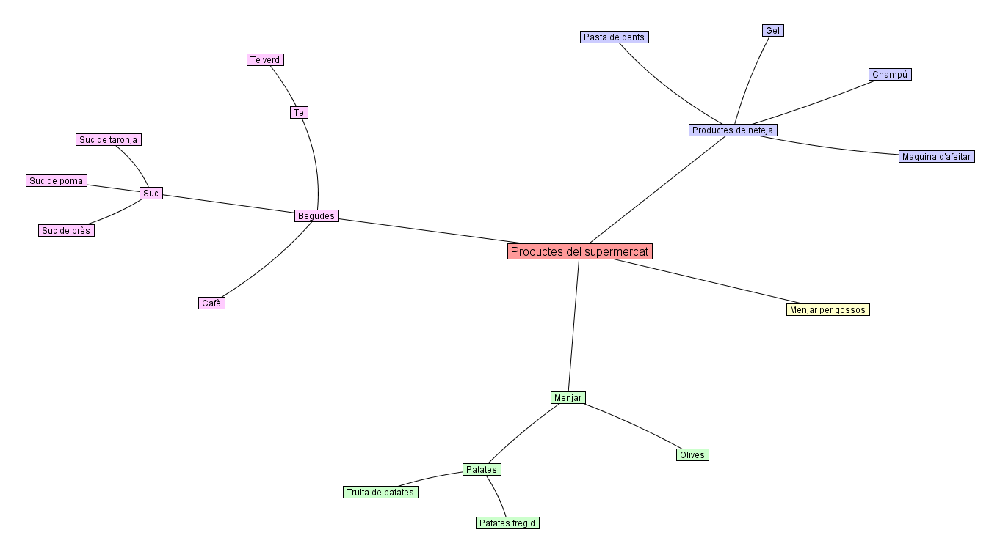

# Visualització de dades PAC2 
Àlex Bedmar Martínez  |  Nov 2023

## Figura 1: Stacked barplot
La figura ha sigut generada en R
 

## Figura 2: Flow Map
La figura ha sigut generada en python
 

## Figura 3: Hyperbolic Tree
La figura ha sigut generada amb HyperTreeStudio (https://hypertree-studio.soft112.com/)
 
 
