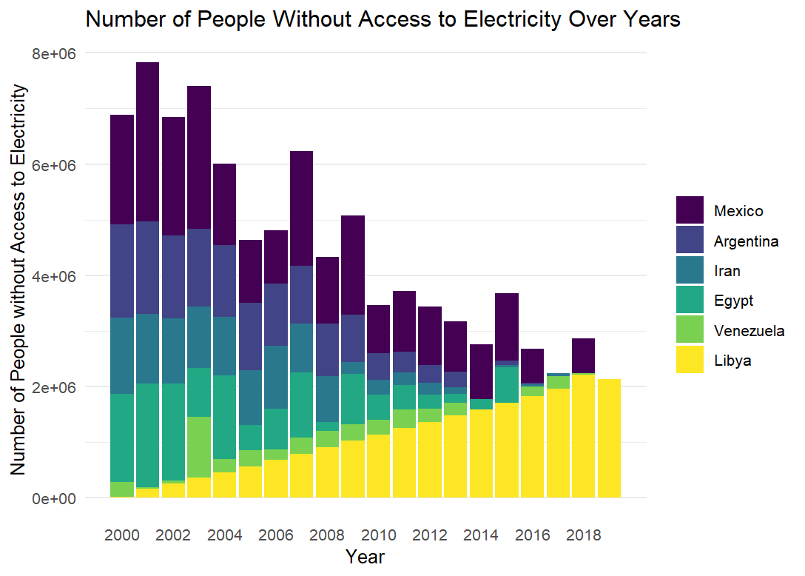

# Visualització de dades PAC2 
Àlex Bedmar Martínez  |  Nov 2023
  
## Figura 1: Stacked barplot
La figura ha sigut generada en R
  

## Figura 2: Flow Map
La figura ha sigut generada en python
  

## Figura 3: Hyperbolic Tree
  
La figura ha sigut generada amb HyperTreeStudio (https://hypertree-studio.soft112.com/)
 
 
